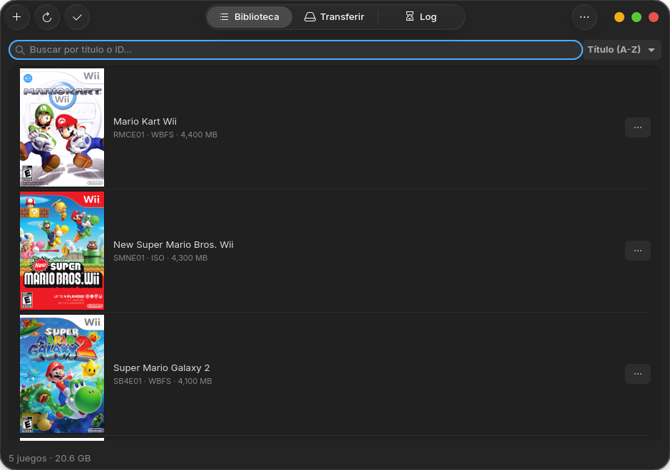
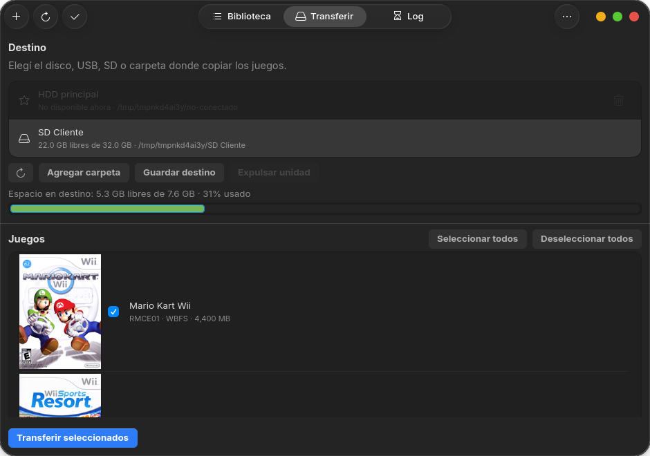
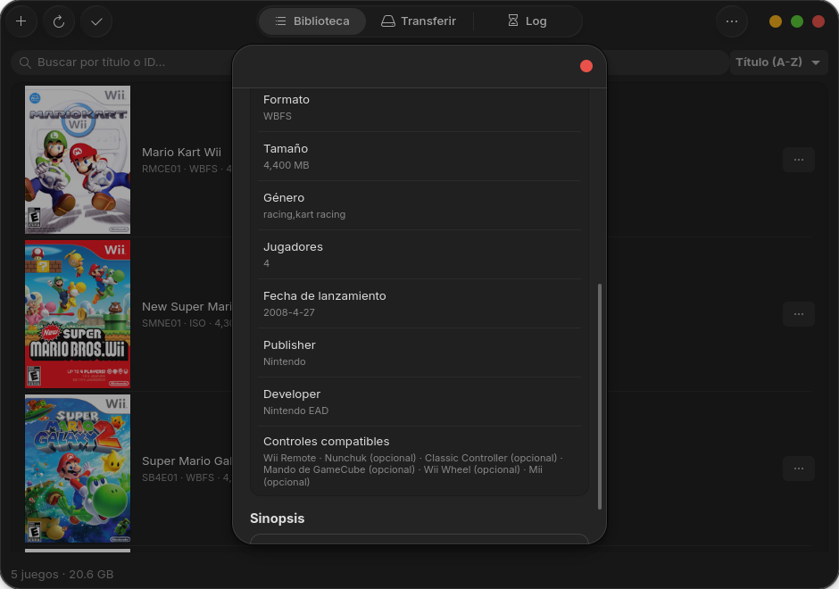
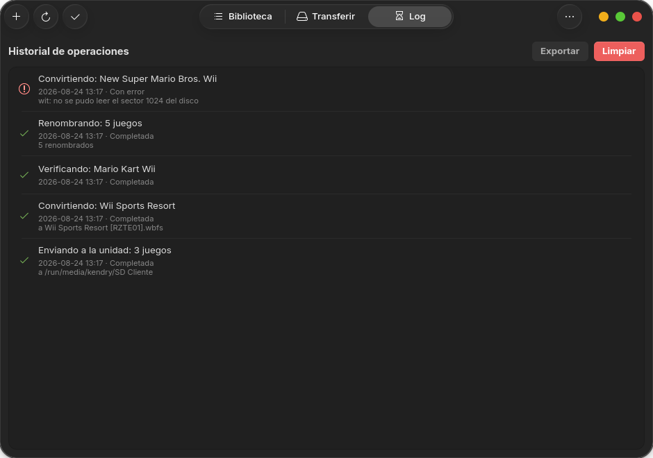

# WiiBackup Manager (Linux)

Gestor de respaldos de Wii para Linux, inspirado en **Wii Backup Manager**
de Windows. Hecho con GTK4 + libadwaita para verse nativo en Fedora/GNOME.




## ¿Qué es esto?

Si tenés respaldos de tus discos de Wii (archivos `.iso` o `.wbfs`) tirados
en una carpeta, esta app te deja:

- **verlos como una biblioteca**, con la carátula y el título de cada juego
  en vez de nombres de archivo sueltos;
- **pasarlos a un pendrive, disco USB o SD** con la estructura que esperan
  los USB Loaders de la Wii, sin acordarte de cómo se llamaba la carpeta ni
  de dividir los juegos grandes a mano;
- **ordenar el desorden**: renombrar todo al formato estándar, convertir
  entre ISO y WBFS para ahorrar espacio, y verificar que un respaldo no
  esté dañado antes de confiar en él.

Está pensada para quien prepara varias Wii seguidas y necesita que cada
paso sea rápido y que nada se pise: la app avisa antes de reemplazar
archivos, deja cancelar cualquier operación larga, y guarda un historial de
todo lo que hizo.

## Capturas

| Transferir a una unidad | Detalle del juego |
|---|---|
|  |  |

| Historial de operaciones |
|---|
|  |

## Funciones

**Biblioteca**

- Escaneo de una carpeta buscando `.iso`, `.wbfs`, `.ciso` y `.wdf`
- Identificación de cada juego (Game ID de 6 caracteres + título)
- Carátulas de [GameTDB](https://www.gametdb.com/) con caché local
- Panel de detalle con género, jugadores, fecha, publisher, developer,
  accesorios compatibles y sinopsis
- Búsqueda por título o ID, y orden por título, tamaño, fecha o formato
- Agregar juegos con el botón **+** o arrastrándolos desde el explorador
- Selección múltiple para operar sobre varios juegos de una
- Renombrado al formato estándar `Título [ID].ext`, de a uno o de toda la
  biblioteca
- Conversión ISO ↔ WBFS y verificación de integridad (vía `wit`)
- Exportar la lista a CSV (para una planilla) o a texto plano (para pegar
  en un chat)

**Transferir**

- Detección automática de pendrives, discos USB y tarjetas SD conectados
- Copia a la estructura `wbfs/<ID>/<ID>.wbfs` que leen los USB Loaders
- **División automática en FAT32**: los discos de doble capa pasan de 4 GB
  y no entran en un archivo de FAT32; la app los parte sola cuando hace
  falta
- Barra de espacio libre del destino, con color según lo que queda
- Destinos guardados con nombre ("HDD principal", "SD cliente") para no
  navegar carpetas cada vez
- Expulsión segura de la unidad desde la app
- Progreso real, tiempo estimado y cancelación de verdad (corta la copia en
  el momento, no cuando termina el archivo)

**Seguridad de tus archivos**

- Pregunta antes de reemplazar cualquier archivo que ya exista
- Nunca pisa un archivo distinto que se llame igual: lo guarda como
  `Juego (2).wbfs`
- No deja que dos operaciones se pisen entre sí (por ejemplo, borrar un
  juego que se está convirtiendo)
- Historial persistente de todas las operaciones, con el motivo de cada
  error

## Requisitos

- **Linux con GNOME** (probado en Fedora; debería andar en cualquier
  distribución con GTK4 y libadwaita)
- **Python 3.10 o más nuevo**
- **`wit` (Wiimms ISO Tools)** — opcional pero muy recomendado. Sin `wit`
  la app abre y lista ISOs planas, pero no puede identificar WBFS/CISO/WDF
  ni convertir ni verificar.

## Instalación paso a paso

> Todo lo que sigue se escribe en la **Terminal**. Para abrirla en GNOME:
> tocá la tecla `Super` (la de Windows), escribí `Terminal` y dale Enter.
> Cada bloque de abajo se copia y se pega tal cual, y se ejecuta con Enter.

### 1. Instalar las dependencias del sistema

```bash
sudo dnf install python3-gobject gtk4 libadwaita python3-pip git
```

Te va a pedir tu contraseña (no se ve nada mientras la escribís, es
normal). En Debian/Ubuntu el comando equivalente es:

```bash
sudo apt install python3-gi python3-gi-cairo gir1.2-gtk-4.0 gir1.2-adw-1 python3-pip git
```

### 2. Instalar `wit` (Wiimms ISO Tools)

Fedora no lo trae en sus repositorios, así que se baja el binario que
publica el propio proyecto:

```bash
cd /tmp
curl -LO https://wit.wiimm.de/download/wit-v3.05a-x86_64.tar.gz
tar xf wit-*.tar.gz
sudo install -m 755 wit-*/bin/wit /usr/local/bin/wit
wit --version
```

Si el último comando imprime una versión, quedó instalado. Si da error
404 al descargar, entrá a [wit.wiimm.de](https://wit.wiimm.de/) y fijate
cuál es la versión actual para cambiarla en el comando.

### 3. Bajar e instalar la app

```bash
cd ~
git clone https://github.com/KendryGod/wiibackup-manager-linux.git
cd wiibackup-manager-linux
pip install --user .
```

`git clone` baja el código a una carpeta nueva
(`~/wiibackup-manager-linux`) y `pip install --user .` instala la app solo
para tu usuario, sin tocar el resto del sistema.

### 4. Abrirla

```bash
wiibackup-manager
```

Si la terminal dice `command not found`, tu sistema todavía no busca
programas en la carpeta donde pip los instaló. Se arregla con:

```bash
echo 'export PATH="$HOME/.local/bin:$PATH"' >> ~/.bashrc
source ~/.bashrc
```

(Si usás zsh en vez de bash, cambiá `~/.bashrc` por `~/.zshrc`.)

Ese ajuste del PATH hace falta **solo para escribir `wiibackup-manager` en
la terminal**. El lanzador del escritorio no depende de él: el `.desktop`
usa `Exec=python3 -m wiibackup_manager`, y `python3` siempre está en el
PATH mínimo con el que arranca la sesión gráfica (en GNOME suele ser solo
`/usr/local/bin:/usr/bin`, sin `~/.local/bin`).

Después de instalar, la app también aparece en el menú de aplicaciones con
su ícono. Si el ícono no se ve, refrescá la caché de íconos:

```bash
gtk-update-icon-cache -f -t ~/.local/share/icons/hicolor
```

### Para actualizar a una versión nueva

```bash
cd ~/wiibackup-manager-linux
git pull
pip install --user .
```

### Para desarrollar (sin instalar el paquete)

```bash
pip install --user -r requirements.txt
python3 -m wiibackup_manager
```

En modo editable (`pip install -e .`) el `.desktop` y los íconos no se
copian solos —es una limitación de los instaladores editables—, así que:

```bash
mkdir -p ~/.local/share/applications
cp data/com.gamefixsps.WiiBackupManager.desktop ~/.local/share/applications/

APP_ID="com.gamefixsps.WiiBackupManager"
for size in 16 32 48 64 128 256 512; do
  mkdir -p ~/.local/share/icons/hicolor/${size}x${size}/apps
  cp "data/icons/hicolor/${size}x${size}/apps/${APP_ID}.png" \
     ~/.local/share/icons/hicolor/${size}x${size}/apps/
done

gtk-update-icon-cache -f -t ~/.local/share/icons/hicolor
```

## Primeros pasos

1. Abrí el menú **⋯ → Preferencias** y elegí la carpeta donde tenés (o
   querés tener) tus respaldos. La app la escanea sola al abrir.
2. Si todavía no tenés nada ahí, usá el botón **+** o arrastrá los
   archivos sobre la ventana: se copian a la carpeta de la biblioteca.
3. Tocá una fila para ver el detalle del juego; el menú **⋮** de cada fila
   tiene renombrar, convertir, verificar y eliminar.
4. Para pasar juegos a una Wii: pestaña **Transferir**, elegí la unidad
   arriba, tildá los juegos y tocá **Transferir seleccionados**. Si vas a
   usar esa unidad seguido, guardala con **Guardar destino** y la próxima
   vez ya está en la lista.
5. La pestaña **Log** guarda qué hizo la app y qué salió mal, incluso de
   sesiones anteriores.

## Problemas comunes

**"No se encontró 'wit'"** — la app funciona igual con ISOs planas, pero
para WBFS/CISO/WDF, convertir y verificar hace falta `wit` (paso 2 de la
instalación).

**Un juego no entra en el pendrive aunque haya espacio** — los pendrives
vienen formateados en FAT32, que no admite archivos de más de 4 GB. La app
divide sola esos juegos, pero necesita `wit` instalado para hacerlo.

**Al arrancar desde la terminal aparece `Adwaita-WARNING ... gtk-application-prefer-dark-theme`**
— no lo produce esta app: sale de tu propia configuración de GTK
(`~/.config/gtk-4.0/settings.ini`, línea
`gtk-application-prefer-dark-theme=1`). libadwaita lo avisa y lo ignora.
Si te molesta, borrá esa línea de ese archivo. La app no se ve afectada.

**Se ve con poco contraste (texto claro sobre fondo claro)** — pasa con
algunos temas GTK de terceros, que reemplazan la hoja de estilos de
libadwaita. Probá **Preferencias → Apariencia → Tema** y fijalo en Claro u
Oscuro; si el tema es el problema, volver al tema estándar (Adwaita) lo
resuelve.

**Faltan juegos que sé que están en la carpeta** — si alguna subcarpeta no
tiene permisos de lectura, la app la saltea y te avisa cuáles fueron;
fijate en la pestaña Log.

## Reportar un error o pedir una función

Los reportes van a
[GitHub Issues](https://github.com/KendryGod/wiibackup-manager-linux/issues).
No hace falta saber programar: con que cuentes qué pasó alcanza. Lo que
más ayuda a arreglarlo rápido:

1. **Qué esperabas que pasara y qué pasó en cambio.**
2. **Los pasos exactos** para que vuelva a pasar ("abrí Transferir, elegí
   la SD, tildé 3 juegos, toqué Transferir y…").
3. **La versión de la app** (menú ⋯ → Acerca de) y tu distribución
   (`cat /etc/os-release | head -2`).
4. **La salida de la terminal**: cerrá la app, abrila desde la terminal con
   `wiibackup-manager` y pegá lo que aparezca ahí cuando falle.
5. **Una captura de pantalla**, si el problema se ve.
6. Si el error fue en una operación sobre archivos, **la entrada de la
   pestaña Log** (tiene el motivo exacto del fallo).

Para pedir una función nueva, contá **qué querés lograr**, no solo qué
botón agregar: muchas veces hay una forma más simple de resolverlo.

## Por qué usa `wit` (Wiimms ISO Tools) por debajo

El formato WBFS (y variantes como CISO/WDF) tiene detalles binarios finos
(tamaño de sector, offset del primer disco, etc.) que son fáciles de leer
mal. En vez de reimplementar ese parseo — con el riesgo de mostrar datos
incorrectos sobre tus respaldos reales — esta app delega la lectura de
formatos envueltos, la conversión y la verificación en
[Wiimms ISO Tools](https://wit.wiimm.de/), que es el estándar de facto en
Linux para esto. Para archivos `.iso` planos, la app lee el header
directamente (sin dependencias) porque ese formato sí está fijo y
documentado.

## Estructura del proyecto

```
wiibackup_manager/
├── app.py                        # Adw.Application
├── window.py                     # Ventana principal: pestaña Biblioteca y lógica de UI
├── config.py                     # Preferencias persistidas (XDG), escritura atómica
├── library.py                    # Escaneo, modelo de datos y exportación
├── disc_header.py                # Parseo de header de ISO plana (sin dependencias)
├── wit_wrapper.py                # Llamadas a `wit` (conversión/verificación/cancelación)
├── gametdb.py                    # Carátulas y metadata de GameTDB, con caché
├── drives.py                     # Detección y expulsión de unidades USB/SD montadas
├── operations.py                 # Coordina las operaciones largas (evita que se pisen)
├── oplog.py                      # Historial persistente de operaciones
├── styles.py                     # CSS propio y esquema de color (claro/oscuro)
└── widgets/
    ├── game_row.py               # Fila de juego en la lista de la Biblioteca
    ├── game_detail_dialog.py     # Panel de detalle del juego (carátula + datos GameTDB)
    ├── preferences_dialog.py     # Diálogo de Preferencias
    ├── transfer_view.py          # Pestaña Transferir: destinos y copia a WBFS
    ├── log_view.py               # Pestaña Log: historial de operaciones
    └── gtk_helpers.py            # Utilidades chicas compartidas por diálogos de GTK
```

## Changelog

### 0.1.6

35 commits desde la 0.1.5. El foco está en integridad de datos: dos
rondas de revisión externa sobre los arreglos de pérdida de datos de la
versión anterior encontraron caminos de código que habían quedado sin la
protección, y esta versión los cierra. Suma además cuatro funciones
nuevas y el README completo.

#### Corregido

- **La app no se abría desde el menú/dock del escritorio.** El `.desktop`
  traía `Exec=wiibackup-manager`, que depende de encontrar el script de
  consola por PATH; con `pip install --user` ese script queda en
  `~/.local/bin`, que no está en el PATH con el que arranca la sesión
  gráfica, así que el lanzador fallaba en silencio aunque el `.desktop` y
  los íconos estuvieran bien instalados. Ahora invoca el módulo con el
  intérprete del sistema (`Exec=python3 -m wiibackup_manager`), que
  funciona en cualquier máquina sin hardcodear la ruta de un usuario.

#### Corregido (crítico — pérdida de datos)

- **Sobrescribir ya no puede perder el respaldo previo, por ningún
  camino**. Reemplazar un archivo en la unidad o al convertir se hace con
  respaldo explícito + intercambio atómico: lo que ya estaba se aparta a
  un nombre oculto, se escribe sobre un nombre libre, y recién al final
  se descarta el respaldo o se lo devuelve a su lugar según cómo haya
  salido. La copia directa escribe en un temporal y lo mueve encima del
  destino, en vez de abrirlo con `"wb"` (que lo vacía en el acto). Las
  revisiones posteriores encontraron dos ramas que se salteaban esta
  protección -la copia sin callbacks de progreso y la conversión sin
  progreso ni cancelación- y ahora no queda ningún camino de escritura
  sin cubrir: hay una sola ruta y está protegida siempre.
- **El timeout de `wit` mata el grupo de procesos completo**, no solo el
  proceso directo. `wit` corre en su propia sesión, así que cualquier
  nieto sobrevivía a la señal y podía seguir escribiendo en el destino
  después de que la app ya había dado la operación por terminada, pisando
  lo que el respaldo acababa de restaurar.
- **Colisiones de nombre al importar, adentro y afuera del lote**. Dos
  archivos del mismo lote llamados igual ya no se pisan entre sí (los
  destinos se reservan al planificar), y un archivo creado por un proceso
  EXTERNO entre el planificado y la copia tampoco: el nombre se reserva
  con `O_CREAT|O_EXCL`, que es atómico y falla si alguien llegó antes, y
  esa colisión tardía se resuelve con un nombre alternativo en vez de
  reemplazar en silencio. Renombrar usa la misma reserva atómica.
- **`--overwrite` de `wit` dejó de enviarse de forma incondicional**. Era
  una trampa para código futuro: cualquier llamada nueva a `convert()`
  que no se ocupara del destino por su cuenta pisaba un juego sin
  enterarse. Ahora es un parámetro explícito, con el default en "no
  pisar", y solo se activa donde corresponde.

#### Corregido

- **Temporales de `wit` huérfanos**: se limpiaban al cancelar y al vencer
  el timeout, pero no cuando `wit` fallaba con un error genérico a mitad
  de la escritura. Una conversión cortada podía dejar varios GB ocupados
  en archivos ocultos que no borraba nadie.
- **Expulsar la unidad mientras se le escribe**: el botón solo miraba si
  el destino era un punto de montaje, así que se podía desmontar un
  pendrive a mitad de una transferencia. Las operaciones declaran ahora
  qué leen, qué escriben y qué lugares ocupan mientras duran.
- **Cancelar congelaba la ventana hasta 10 segundos** esperando a que el
  proceso muriera. El SIGTERM sale en el acto y la espera de gracia queda
  en un hilo aparte.
- **Espacio necesario mal estimado para CISO y WDF**: esos formatos ya
  vienen compactos, así que el archivo puede pesar mucho menos que el
  WBFS que va a generar. El chequeo previo pasaba igual y `wit` fallaba a
  mitad de una transferencia larga con el disco lleno. Ahora se le
  pregunta a `wit ISOSIZE` cuánto ocupa el juego de verdad, y el cálculo
  corre fuera del hilo de GTK.
- **La importación informaba "completada" con archivos que fallaron**: un
  archivo que no se podía identificar o copiar hacía `continue` en
  silencio. Ahora cada fallo se anota con su motivo y el estado refleja
  lo que pasó (completada, parcial o error).
- **La caché de carátulas no distinguía la región**, así que el selector
  de región no hacía nada después del primer uso.
- **Escaneo fallido mostrado como biblioteca vacía**: si el disco se
  desconectaba a mitad del recorrido, el usuario abría la app y veía la
  lista vacía sin saber que fue un error. Ahora se conserva la última
  lista conocida y se avisa.
- **Progreso y ETA inflados**: los juegos que fallaban o que ya estaban
  en el destino sumaban su tamaño al progreso como si se hubieran
  escrito, y la conversión medía contra los bytes del origen en vez de
  los de salida (convertir un WBFS de 350 MB a ISO da 4.7 GB, no 350 MB).
- **Historial roto por timestamps sin zona horaria**: bastaba una entrada
  mezclada para que fallara la carga del historial completo.
- **Una sola entrada de historial por lote de renombrado**, en vez de dos
  para la misma acción.
- **Guardar preferencias podía tirar una excepción sin manejar** desde el
  callback de GTK si el disco estaba lleno o la carpeta no era escribible.
- **Fórmulas en el CSV exportado**: un título como `=1+1` (o algo peor)
  se ejecutaría al abrir la lista en una hoja de cálculo. Los campos de
  texto se neutralizan, y la exportación se escribe de forma atómica.
- **Un fallo de red dejaba la metadata rota hasta reiniciar la app**: el
  índice vacío y las respuestas nulas se cacheaban como definitivas.
- **Carátulas cortadas cacheadas como válidas**: se daba por buena
  cualquier descarga cuyos primeros 8 bytes fueran el magic de PNG. Ahora
  se valida el archivo entero y se guarda de forma atómica.
- **Consultas de metadata de GameTDB duplicadas**: con 300 juegos se
  encolaban 300 tareas idénticas después de cada rescan. Ahora se
  deduplican y se cachean como ya hacían las carátulas.

#### Agregado

- **Renombrar en lote** toda la biblioteca (o lo seleccionado) al formato
  estándar "Título [ID].ext", con ejemplos concretos en la confirmación,
  progreso y cancelación. Los que ya están bien se saltean.
- **Exportar la lista de juegos** a CSV o a texto plano, respetando el
  filtro del buscador y el orden de la pantalla.
- **Destinos guardados** (accesos rápidos con nombre propio) en la
  pestaña Transferir. Un destino que no está disponible se muestra
  apagado en vez de desaparecer.
- **Elegir la apariencia** desde Preferencias: Sistema (por defecto),
  Claro u Oscuro.

#### Otros

- README completo, escrito para alguien que nunca vio el proyecto.
- Toda la configuración de empaquetado unificada en `pyproject.toml`.

### 0.1.5

Se salta la 0.1.4. Esta versión junta 36 commits de correcciones de
integridad de datos, coordinación de operaciones y rendimiento de la
lista, más la metadata extendida de GameTDB.

#### Corregido

- **Path traversal**: el Game ID sale del header del archivo (contenido
  que la app no controla) y se usaba para armar rutas del filesystem sin
  validar. Ahora se valida antes de convertirlo en un componente de ruta.
- **Sobrescrituras silenciosas**: convertir ISO↔WBFS, enviar a una unidad
  WBFS e importar pisaban un archivo existente sin preguntar. Los tres
  confirman ahora con el mismo diálogo; al importar en lote, además, el
  archivo entra con un nombre alternativo ("Juego (2).wbfs") en vez de
  reemplazar a otro juego que tuviera el mismo nombre.
- **Cancelar no cancelaba**: era una bandera que se miraba entre juegos,
  así que un `wit` copiando 20 minutos seguía hasta el final. Ahora se
  mata el proceso (y su grupo) en el acto. La copia directa revisa la
  cancelación cada 1 MiB en vez de cada 4 MiB.
- **Timeout de `wit`**: era absoluto y cortaba copias lentas pero sanas.
  Ahora se lo da por colgado por inactividad (que el destino no crezca),
  con el límite absoluto solo como última red.
- **WBFS en FAT32**: los discos dual-layer de más de 4 GB no entran en
  FAT32 y quedaban truncados. Se divide con `--split-size` explícito
  cuando el destino lo necesita.
- **Operaciones simultáneas peligrosas**: un gestor central impide borrar
  o renombrar un juego que se está convirtiendo, dos escaneos que se
  pisan el resultado, y escanear mientras se escriben archivos en la
  biblioteca. El bloqueo es por conflicto real: verificar o borrar un
  juego suelto mientras se convierte OTRO sigue permitido, y cada botón
  se apaga solo si su propia acción no puede arrancar.
- **Carátulas**: la pestaña Transferir lanzaba un hilo por fila (300
  juegos = 300 descargas simultáneas). Ahora hay un único pool compartido
  con toda la app, y un rescan no vuelve a encolar lo que ya está en
  vuelo.
- **Escritura atómica** de `config.json` y del historial, con validación
  de tipos al leerlos: un corte a mitad de la escritura ya no deja el
  archivo corrupto.
- **Crash con carátulas tardías**: los callbacks de GameTDB tocaban la
  fila sin comprobar que siguiera existiendo. Reordenar la lista o cerrar
  el panel de detalle con una descarga en vuelo podía tirar la app
  (`Gtk-CRITICAL` y volcado de core). Además, una fila reusada que pasó a
  mostrar otro juego descarta los datos del anterior si llegan tarde.
- **Caché de `wiitdb.xml` corrupta**: si el volcado cacheado no parseaba,
  el índice quedaba vacío para siempre y no volvían a aparecer ni la
  sinopsis ni los controles. Ahora se descarta y se baja de nuevo, y un
  XML recién bajado se valida antes de quedar como caché buena.
- **Selección múltiple**: ya no se pierde al cambiar el orden ni al
  rescanear, así que se puede mandar la misma tanda de juegos a una
  unidad y después a la siguiente sin volver a tildarlos.
- **Rendimiento de la lista**: reordenar y reescanear reconstruían las
  filas una por una. Con 300 juegos, cambiar el orden pasó de ~900 ms a
  6 ms y un rescan sin cambios de ~700 ms a 10 ms.
- **Carpetas sin permiso**: se salteaban en silencio al escanear y
  faltaban juegos sin explicación. Ahora el escaneo sigue igual con el
  resto, pero avisa cuáles quedaron afuera y lo anota en el historial.
- **Parseo de contenedores WBFS multi-juego**: el título se mezclaba con
  las columnas de tamaño y región.

#### Agregado

- **Panel de detalle con datos de GameTDB**: sinopsis y accesorios
  compatibles (Wii Remote, Nunchuk, Balance Board…), además de género,
  jugadores, fecha, publisher y developer.
- **Título original de GameTDB** junto al título del disco, cuando aporta
  algo distinto de lo que ya se ve.
- **Barra de uso de disco** en el destino de Transferir, coloreada según
  el espacio que queda.
- **Pestaña Log**: historial persistente de todas las operaciones, con su
  resultado y el motivo de los errores.
- **Cancelar** ahora también en la conversión (individual y en lote) y en
  los lotes de verificar y eliminar, con el proceso en curso muerto de
  verdad y un resumen de cuántos se alcanzaron a procesar.
- **Ícono propio de la aplicación** instalado en el sistema (16 a 512 px)
  y referenciado desde el `.desktop`.
- **Progreso real por bytes** dentro de la conversión o copia de un solo
  juego grande, en vez de saltar de 0% a 100% al terminar.

### 0.1.3

- La pestaña Transferir valida sus destinos (unidades y carpetas agregadas
  a mano) al refrescar: si dejaron de existir o ser accesibles (unidad
  expulsada/desconectada), desaparecen solos de la lista en vez de quedar
  mostrados con un error genérico de espacio.
- Detección automática de unidades nuevas/desconectadas en Transferir por
  sondeo periódico (cada 3s, mismo patrón que la detección de la
  Biblioteca desconectada): ya no hace falta cambiar de pestaña ni
  refrescar a mano.
- El selector de "Agregar carpeta" (Biblioteca y Transferir) ya no muestra
  el error nativo "No se pudo encontrar «...»" cuando la última carpeta
  usada quedó en una unidad desconectada: cae en silencio a la carpeta
  home.
- La versión mostrada en "Acerca de" ahora se toma de `__version__`.

### 0.1.2

- Barra de estado en la Biblioteca con el total de juegos y tamaño.
- Botón para expulsar la unidad WBFS de forma segura antes de
  desconectarla.

### 0.1.1

- Pestaña Transferir: copiar juegos seleccionados a una unidad WBFS (USB
  Loader), con ETA, progreso y cancelación.
- Selección múltiple y acciones en lote (enviar, convertir, verificar,
  eliminar) en la Biblioteca.
- Panel de detalle del juego, orden de la lista y arrastrar y soltar
  (drag & drop) para agregar archivos.
- Mostrar espacio libre del destino y validarlo antes de transferir.
- Evitar un crash al abrir la app con `library_path` apuntando a un mount
  desconectado.

## Roadmap / ideas pendientes

- [ ] Vista de cuadrícula con carátulas grandes (alternativa a la lista)
- [ ] Soporte para múltiples carpetas de biblioteca
- [ ] Listar y exportar lo que ya hay EN una unidad WBFS
- [ ] Empaquetado como Flatpak
- [ ] Traducciones (i18n)

## Licencia

MIT — ver [LICENSE](LICENSE).
